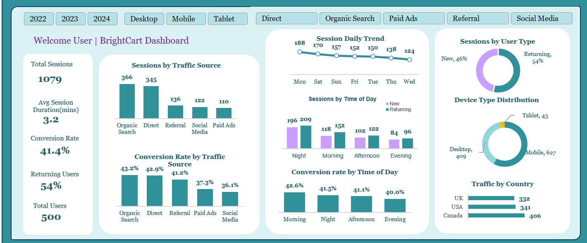

## Maximizing Online Retail Performance: Analyzing Traffic Patterns by Time and Source

## Project Overview
BrightCart operates in a competitive e-commerce environment but lacked visibility into when users engage most, which channels drive high-value traffic, and how behavioural patterns influence conversion outcomes.  

In this project, I conducted a comprehensive analysis of traffic trends across time of day, day of week, acquisition channels, devices, and geographies. The goal was to identify performance gaps and provide actionable insights to optimise marketing effectiveness and conversion rates.

---

## Project Description
I led this end-to-end analytics project diagnosing inefficiencies in digital traffic performance and marketing ROI.  

The analysis focused on user behaviour across multiple dimensions—traffic sources, engagement timing, device usage, and regional trends—to uncover conversion gaps and missed revenue opportunities.  

The outcome is a set of commercially driven recommendations designed to optimise campaign timing, channel investment, and overall customer engagement.

---
## Project Image

## Interactive dashboard
[Click here to interact with the dashboard](./BrightCart.xlsx)

---
## Key Insights
- Organic search is the strongest driver of both traffic and conversions, while paid ads underperform in ROI  
- Direct traffic indicates a loyal, high-value customer base  
- Peak engagement occurs during **morning and night**, with the highest conversion rates  
- Mobile accounts for ~60% of total traffic, making it the dominant user channel  
- North America outperforms the UK in traffic and engagement  
- Traffic peaks on **Mondays and weekends**, with midweek dips  

---

## Recommendations
- Reallocate marketing budget toward high-performing channels (Organic & Direct)  
- Shift paid advertising strategy to **retargeting high-intent users**  
- Schedule campaigns during **peak conversion periods (Morning & Night)**  
- Optimise for **mobile-first user experience** (speed, checkout, usability)  
- Localise campaigns for high-performing regions (US & Canada)  
- Implement **time-based and behavioural personalisation**  

---

## Business Impact
-  15–25% potential increase in conversion rates through better campaign timing  
-  20–30% improvement in marketing ROI via channel optimisation  
-  10–20% increase in revenue per session from UX improvements  
-  Improved customer retention and repeat purchase behaviour  
-  Reduced wasted spend through smarter budget allocation  

---
## Tools & Technologies
- Used Power Query to clean, transform and model raw engagement ans session data
- Applied Power Pivot for data modelling, relationships and DAX-based calculations
- Built an interactive dashboard using Excel's visualisation tools,slicers and pivot charts

---

## Key Takeaway
BrightCart is not facing a demand problem, but an optimisation opportunity. By aligning marketing strategy with user behaviour and high-performing channels, the business can significantly improve revenue efficiency without increasing traffic volume.

---

## Project dataset
[View raw dataset here](./dataset/BrightCart_raw.xlsx)
 
---

##  Author
**Chukwuemeka Nwankwo**  
Data Analyst | Business Intelligence | Insights & Strategy